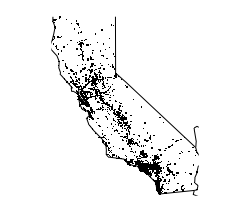

```{r setup, include=FALSE}
knitr::opts_chunk$set(echo = TRUE)
#library(dplyr)
#library(foreign)
#library(graphics)
#library(lubridate)
#library(magrittr)
#library(maps)
#library(readr)
#library(tidyr)
#source("fars_functions.R")
```

### Introduction

The National Highway Traffic Safety Administration (NHTSA) of the United States Department of Transportation maintains a nation-wide sensus providing yearly data on fatal injuries suffered in motor vehicle traffic crashes. The data is available from the Fatality Analysis Reporting System (FARS), which contains details of fatal accidents from 1975 onwards, and can be accessed by FTP: <ftp://ftp.nhtsa.dot.gov/fars/>.  
  Among the many files in the data set of a particular year, the file called "accident.dbf" (in Database File format) contains the essential data. This file should be converted to a .csv.bz2 file with the filename confention "accident_yyyy.csv.bz2", where yyyy is the year the file relates to. A function to do this is included in this package (see below).

#### The FARS_Data_Analysis functions

This package contains four functions. The first, *make_fars_file*,  is a helper function that will take an "accidents.dbf" file from the above mentioned FTP site -which it assumes is put in the working directory by the user- and convert it to a .csv.bz2 file, giving the file the above mentioned filename based on the year parameter supplied. If used in an assignment, the function returns a data frame containing the FARS data.

These examples assume the accidents.dbf file of 2012 is in the working directory:
```{r make_fars_file, eval=FALSE}
# only to write "accidents_2012.csv.bz2" to working directory:
make_fars_file(2012)
# to also assign the data.frame to a variable:
f2012 <- make_fars_file(2012)
```


The second function, *fars_read_years*, takes a vector of one or more numbers representing the years of which the FARS data sets are needed for further analysis. The function returns a list of data files, representing the years specified.

These examples assume the data files for the years specified are in the working directory:
```{r fars_read_years, eval=FALSE}
## get a list for only the data from 2015:
l15 <- fars_read_years(2015)
## getting a list for multiple years (they don't have to be consecutive):
l131415 <- fars_read_years(c(2013, 2014, 2015))
```


The third function, *fars_summarize_years*, takes a vector of years and returns a table of number of accidents with fatalities per month (rows) of the years asked for (columns).
For example, a table of the number of fatal accidents per month in 2013, 2014 and 2015:
```{r fars_summarize_years, eval=FALSE}
fars_summarize_years(c(2013, 2014, 2015))
```

:A tibble: 12 x 4

| # | MONTH | `2013` | `2014` | `2015` |
|:-:|:-----:|:------:|:------:|:------:|
| 1 |   1   |  2230  |  2168  |  2368  |
| 2 |   2   |  1952  |  1893  |  1968  |
| 3 |   3   |  2356  |  2245  |  2385  |
| 4 |   4   |  2300  |  2308  |  2430  |
| 5 |   5   |  2532  |  2596  |  2847  |
| 6 |   6   |  2692  |  2583  |  2765  |
| 7 |   7   |  2660  |  2696  |  2998  |
| 8 |   8   |  2899  |  2800  |  3016  |
| 9 |   9   |  2741  |  2618  |  2865  |
|10 |  10   |  2768  |  2831  |  3019  |
|11 |  11   |  2615  |  2714  |  2724  |
|12 |  12   |  2457  |  2604  |  2781  |

The fourth function, *fars_map_state*, takes a state number and a year to create a map of the state with accidents plotted by longitude and latitude. The state number is explained on page 26 of the manual available at <https://crashstats.nhtsa.dot.gov/Api/Public/Publication/812315>, showing a table of state Codes. For example California is number 6, so getting the plotted data from California in 2015:
```{r fars_map_state, eval=FALSE}
fars_map_state(6, 2015)
```


A plot of all fatal accidents in California in 2015.
